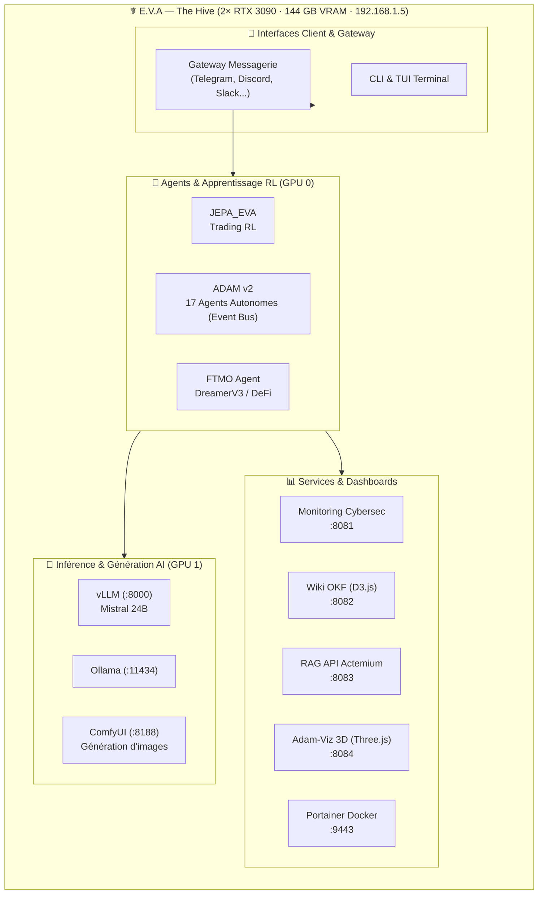

<p align="center">
  
</p>

# ☤ Agent EVA — Evolving Virtual Assistant

<p align="center">
  <a href="https://github.com/JohnNuwan/EVA_CORE">Agent EVA</a> •
  <em>Le système d'exploitation agentique industriel et financier</em>
</p>

<p align="center">
  <a href="https://discord.gg/NousResearch"></a>
  <a href="https://github.com/JohnNuwan/EVA_CORE/blob/main/LICENSE"></a>
  
  
  
  
</p>

**EVA, l'agent IA auto-améliorant basé sur Hermes Agent.** C'est le seul agent doté d'une boucle d'apprentissage intégrée : il crée des compétences (skills) à partir de son expérience, les améliore en cours d'utilisation, s'incite à conserver ses connaissances, recherche dans ses propres conversations passées et construit un modèle approfondi de qui vous êtes au fil des sessions. Lancez-le sur un VPS à 5 $, un cluster GPU ou une infrastructure serverless qui ne coûte presque rien lorsqu'elle est inactive. Il n'est pas lié à votre ordinateur : parlez-lui depuis Telegram pendant qu'il travaille sur une machine virtuelle dans le cloud.

---

## 🚀 Bibliothèque de Capacités EVA (Finance & Industrie)

EVA n'est pas un simple assistant de code ; c'est un **système d'exploitation agentique industriel et financier** doté d'une bibliothèque gigantesque :

* 🎯 **1127+ Skills (Compétences Métiers) :** Des directives de haut niveau écrites en français pour guider les décisions de l'agent, couvrant 60+ domaines.
* 🛠️ **118+ Tools (Outils d'Exécution) :** Des scripts Python modulaires auto-enregistrés permettant à EVA d'agir directement sur son environnement.
* 🤖 **17 Agents Adam :** Une équipe d'agents spécialisés en CI/CD, QA, documentation, backup, red team, finance, recherche biomédicale, et plus encore.

### 📈 Capacités de Finance & Trading (MetaTrader 5)

EVA intègre une suite de trading modulaire et sécurisée (architecture *Narrow Waist* : 1 Skill + 1 Tool par capacité) :
* **Analyse de Marché :** Calcul en temps réel des supports, résistances (fenêtre glissante de 5 bougies), RSI 10 et moyennes mobiles SMA 30/60.
* **Exécution d'Ordres :** Passage d'ordres d'achat, de vente, clôture et modification des niveaux de Stop Loss/Take Profit.
* **Double Mode :**
  1. **Paper Trading (Simulation) :** Bac à sable local persistant dans `~/.hermes/finance_positions.json` valorisé avec des cours réels (via `yfinance`).
  2. **Passage d'Ordres Réels :** Connexion HTTP vers l'API REST de MetaTrader 5.

### 🏭 Capacités d'Automatisation Industrielle (Industrie 4.0)

EVA dispose d'une suite complète pour piloter et diagnostiquer les systèmes automatisés physiques :
* **Protocoles Réseau :** Lecture/Écriture en OPC UA, Modbus TCP/IP, pilotes d'automates Rockwell, Siemens S7 et Beckhoff ADS.
* **Analyse PCAP :** Analyse passive et détection d'anomalies sur les réseaux opérationnels (OT).
* **Génération de Code & RAG :** Génération de code API automate et consultation de schémas/manuels via RAG industriel.
* **Sécurité Fonctionnelle :** Évaluation et optimisation de la sécurité opérationnelle (niveaux de performance SIL).

---

## 🏗️ Architecture — The Hive



### 📊 Allocation GPU

| GPU | Usage | Services |
|-----|-------|---------|
| **GPU 0** | Entraînement | JEPA_EVA, FTMO DreamerV3, ADAM v2 |
| **GPU 1** | Inférence | vLLM Mistral 24B, Ollama, ComfyUI |

---

## 🤖 Adam Agents — L'Équipe Autonome (v2)

EVA orchestre une équipe de **17 agents spécialisés** (les Adam) qui travaillent en parallèle via un event bus SQLite WAL :

| Agent | Mission | Statut |
|-------|---------|--------|
| **ADAM-PRAETOR** | Surveillance système, cycles réguliers | ✅ Actif |
| **ADAM-SENTINEL** | Veille technologique 24/24 | ✅ Actif |
| **ADAM-CRITIC** | Audit qualité, scan AST, auto-fix imports | ✅ Actif |
| **ADAM-CICD** | Pipeline CI/CD, hooks git, auto-commit + push | ✅ Actif |
| **ADAM-ARCHITECT** | Conception & architecture logicielle | ✅ Actif |
| **ADAM-SCRIBE** | Rédaction & documentation | ✅ Actif |
| **ADAM-TREASURER** | Finance & rentabilité ($51/jour tracking) | ✅ Actif |
| **ADAM-RESEARCHER** | Veille scientifique biomédicale (PubMed + arXiv + bioRxiv) | ✅ Actif |
| **ADAM-SOCIAL** | Influence virtuelle & monétisation | ✅ Actif |
| **ADAM-RED** | Red team, pentest Android (Nothing Phone 2) | ✅ Actif |
| **ADAM-BLUE** | Sécurité 24/24, hardening, blue team | ✅ Actif |
| **ADAM-MONITOR** | Surveillance hardware, métriques GPU | ✅ Actif |
| **ADAM-BACKUP** | Sauvegarde et récupération des données | ✅ Actif |
| **ADAM-DEPLOY** | Déploiement & restart des services | ✅ Actif |
| **ADAM-DOCTOR** | Visite médicale, diagnostic système | ✅ Actif |
| **ADAM-SELF-HEAL** | Auto-guérison, heartbeat, correction automatique | ✅ Actif |
| **ADAM-VIZ-CHECKER** | Vérification des dashboards | ✅ Actif |

### 🔴 ADAM-RED — Défi en cours : Nothing Phone 2

Cible : **Nothing Phone 2** (modèle A065, codename Pong, SoC Snapdragon 8+ Gen 1)
- Connecté en USB (serial `2f109ecc`, vendor 18d1:4ee7)
- Handler : `scripts/adam-red-challenge.py` — 5 phases (recon → fingerprint → enum → escalation → report)
- Dernier scan : Android 16, patch 2026-04-01, SELinux Enforcing, bootloader verrouillé
- **Root non obtenu** — device durci

---

## 📊 Live Dashboard

Le monitoring en temps réel de The Hive est accessible via les dashboards suivants :

| Service | Port | Description |
|---------|------|-------------|
| **Monitoring Cybersec** | `http://localhost:8081` | Métriques CPU, RAM, GPU, réseau, alertes (Chart.js local) |
| **Wiki OKF (D3.js)** | `http://localhost:8082` | Graphe de connaissances, index des pages |
| **RAG Actemium** | `http://localhost:8083` | API de recherche RAG, stats `/api/rag/stats` |
| **Adam-Viz 3D** | `http://localhost:8084` | Visualisation 3D des agents Adam (Three.js local) |
| **Portainer** | `http://localhost:9443` | Gestion des conteneurs Docker |

> ⚠️ **Toutes les dépendances JS/CSS sont servies en local** (pas de CDN) — The Hive n'a pas d'accès Internet direct.

---

## 📚 OKF Wiki — Open Knowledge Format

Le wiki EVA suit le format **OKF (Open Knowledge Format)** — un système de connaissances interconnectées :

- **60+ pages** organisées en entités, concepts et comparaisons
- **Graphe de connaissances D3.js** visualisé sur :8082
- **1127 skills** documentées en 52 catégories
- **Liens [[wikilinks]]** pour la navigation inter-pages
- **Frontmatter YAML** structuré sur chaque page

Le wiki vit dans `~/wiki/` et suit le schéma défini dans `~/wiki/SCHEMA.md`.

---

## 🔍 RAG Stack — Retrieval-Augmented Generation

EVA intègre un pipeline RAG industriel complet :

- **ChromaDB** — Base vectorielle locale pour la recherche sémantique
- **HippoRAG 2** — Indexation avancée avec graphe de connaissances
- **API REST** sur :8083 pour l'interrogation
- **Domaine :** Automatisme industriel (Actemium, manuels, schémas)

---

## 🛡️ Monitoring Cybersec

Suite de surveillance système et cybersécurité :

- **hardware-mon.sh** — CPU, RAM, GPU, disques, températures
- **network-mon.sh** — Bande passante, connexions, ARP spoofing
- **packet-capture.sh** — Capture de paquets avec rotation automatique
- **master-dashboard.sh** — Tableau de bord unifié toutes les 5s

Les scripts se trouvent dans `~/monitoring-cybersec/` et sont configurés via `config.ini`.

---

## 🧠 Bibliothèque de Connaissances

| Domaine | Skills | Description |
|---------|--------|-------------|
| Automatisme industriel | 184+ | Multi-constructeurs (Siemens, Rockwell, Beckhoff...) |
| Recherche scientifique | 160+ | arXiv, domaines académiques, veille |
| Cybersécurité | 140+ | Pentest, OSINT, reverse, forensics, OT |
| Prompt engineering | 22 | 22 méthodes avancées |
| DevOps / MLOps | 22+ | Docker, Kubernetes, CI/CD, GPU training |
| Développement | 25+ | Python, test, GitHub, refactoring |
| Finance / Trading | 12+ | DeFi, analyse technique, options, rendement |
| Création / Média | 14+ | ASCII art, design, audio, vidéo |
| Systèmes | 11+ | Linux, Windows AD, BSD, AIX, Solaris |
| Productivité | 13+ | Freelance, Notion, Airtable, PowerPoint |
| Edge AI / IoT | 14+ | TinyML, ESP32, FPGA, ARM embarqué |

---

## 💻 Utilisation

```
hermes              # CLI Interactive — démarrer une conversation
hermes model        # Choisir votre fournisseur LLM et votre modèle
hermes tools        # Configurer les outils activés
hermes config set   # Définir des valeurs de configuration individuelles
hermes gateway      # Démarrer la passerelle de messagerie (Telegram, Discord, etc.)
hermes setup        # Lancer l'assistant de configuration complet
hermes update       # Mettre à jour vers la dernière version
hermes doctor       # Diagnostiquer les problèmes éventuels
```

📖 **Documentation Technique EVA :**
- [Index & Architecture de la Documentation](docs/README.md)
- [Fiches Techniques des 17 Agents ADAM](docs/adam-agents.md)
- [Guide des 1127+ Compétences (Skills)](docs/skills-guide.md)
- [Documentation Officielle Hermes →](https://hermes-agent.nousresearch.com/docs/)

---

## 🚀 Installation

### Prérequis

- **Python 3.11+** — recommandé via `uv` (installé automatiquement si absent)
- **Git** — pour cloner le dépôt
- **GPU (optionnel mais recommandé)** — NVIDIA avec CUDA 12.x pour inference locale (vLLM)
- **OS** — Linux (recommandé), macOS, Windows (via WSL2)

### Installation rapide (Linux / macOS)

```bash
# Clone EVA
git clone https://github.com/JohnNuwan/EVA_CORE.git ~/.hermes/hermes-agent

# Lance l'installateur
cd ~/.hermes/hermes-agent
bash scripts/install.sh
```

L'installateur détecte automatiquement votre OS, installe `uv`, crée un environnement virtuel, installe les dépendances Python, et lance l'assistant de configuration interactif.

### Installation sur Windows (via PowerShell)

```powershell
iex (irm https://raw.githubusercontent.com/JohnNuwan/EVA_CORE/main/scripts/install.ps1)
```

### Installation minimaliste (sans assistant)

```bash
git clone https://github.com/JohnNuwan/EVA_CORE.git ~/.hermes/hermes-agent
cd ~/.hermes/hermes-agent
bash scripts/install.sh --skip-setup
hermes setup   # Configurer les clés API plus tard
```

### Mise à jour

```bash
hermes update
```

### La Stack The Hive (inférence locale)

Pour faire tourner EVA en local avec des LLM open-source sur The Hive :

```bash
# Installer Docker si pas déjà fait
curl -fsSL https://get.docker.com | sh

# Lancer la stack IA (vLLM + services)
cd ~/.hermes/hermes-agent
docker compose -f docker/docker-compose.yml up -d

# Vérifier les modèles disponibles
curl http://localhost:8000/v1/models
```

Puis configurer EVA pour utiliser le provider local :

```bash
hermes config set model "deepseek/deepseek-v4-flash"
hermes config set provider "openrouter"
# ou pour le local :
hermes config set provider "local-vllm"
```

### Configuration des ADAMs (agents autonomes)

Les ADAMs sont gérés par l'event bus v2 (SQLite WAL) dans `~/eva-adam-v2/`. Pour les activer :

```bash
# Lancer le daemon event bus
cd ~/eva-adam-v2
python3 event_daemon.py &

# Lancer le cycle principal (hive_cycler)
python3 hive_cycler.py &

# Lancer l'auto-guérison
python3 self_heal.py &
```

---

## Licence

MIT — voir [LICENSE](LICENSE).

Basé sur Hermes Agent par [Nous Research](https://nousresearch.com).
