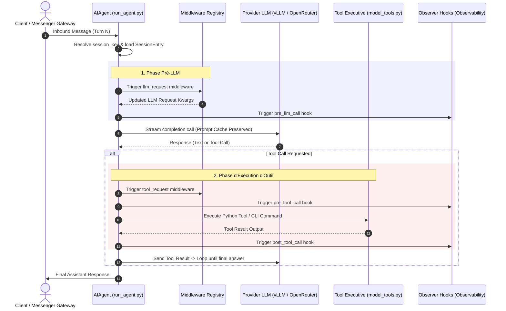

# ☤ Documentation Technique Agent EVA (EVA CORE)

Bienvenue dans le centre de documentation technique d'**EVA (Evolving Virtual Assistant)**. Ce dossier rassemble l'ensemble des spécifications d'architecture, des contrats d'interface, des guides de sécurité et des manuels d'extension.

---

## 🧭 Carte de la Documentation

| Domaine / Composant | Fichier de Spécification | Description |
| --- | --- | --- |
| **Index & Vue d'ensemble** | [docs/README.md](file:///c:/Users/john.moncel/Desktop/IA_Recherche/EVA_CORE/docs/README.md) | Ce document (Index global et boucle d'exécution de l'agent). |
| **Agents Autonomes** | [docs/adam-agents.md](file:///c:/Users/john.moncel/Desktop/IA_Recherche/EVA_CORE/docs/adam-agents.md) | Guide d'orchestration et fiches techniques des **12 Agents ADAM**. |
| **Guide des Compétences** | [docs/skills-guide.md](file:///c:/Users/john.moncel/Desktop/IA_Recherche/EVA_CORE/docs/skills-guide.md) | Guide de création, chargement et gestion des **1072+ Skills**. |
| **Gestion des Sessions** | [docs/session-lifecycle.md](file:///c:/Users/john.moncel/Desktop/IA_Recherche/EVA_CORE/docs/session-lifecycle.md) | Cycle de vie des sessions, état SQLite, gestion de l'inactivity et crash recovery. |
| **Passerelle & Connecteurs** | [docs/relay-connector-contract.md](file:///c:/Users/john.moncel/Desktop/IA_Recherche/EVA_CORE/docs/relay-connector-contract.md) | Spécification de protocole WebSocket entre Hermes Gateway et les connecteurs. |
| **Planificateur Chronos** | [docs/chronos-managed-cron-contract.md](file:///c:/Users/john.moncel/Desktop/IA_Recherche/EVA_CORE/docs/chronos-managed-cron-contract.md) | Exécution différée et serverless des tâches planifiées via NAS. |
| **Sécurité & Isolation** | [docs/security/network-egress-isolation.md](file:///c:/Users/john.moncel/Desktop/IA_Recherche/EVA_CORE/docs/security/network-egress-isolation.md) | Isolation réseau des conteneurs Docker et filtrage Egress proxy. |
| **Observabilité & Hooks** | [docs/observability/README.md](file:///c:/Users/john.moncel/Desktop/IA_Recherche/EVA_CORE/docs/observability/README.md) | Télémétrie, hooks d'exécution (`pre_tool_call`, `post_tool_call`, etc.). |
| **Système Middleware** | [docs/middleware/README.md](file:///c:/Users/john.moncel/Desktop/IA_Recherche/EVA_CORE/docs/middleware/README.md) | Interception et réécriture dynamique des requêtes LLM et des outils. |

---

## ⚡ Boucle d'Exécution de l'Agent (`AIAgent Execution Loop`)

Le schéma ci-dessous illustre le flux de traitement synchrone et asynchrone lorsqu'un message parvient à l'agent :

---

## 🛠️ Principes d'Ingénierie Sacrés

Toute modification apportée à EVA CORE doit se conformer aux principes énoncés dans [AGENTS.md](file:///c:/Users/john.moncel/Desktop/IA_Recherche/EVA_CORE/AGENTS.md) :

1. **Stabilité du Prompt Cache** : Le préfixe du prompt système ne doit **jamais** être modifié dynamiquement en cours de session.
2. **Narrow Waist Core** : Le cœur (`eva_core/`) reste le plus étroit possible. Les capacités résident dans les *skills*, *tools* et *plugins*.
3. **Mocks E2E Réalistes** : Tout test de fonctionnalité d'E/S doit être testé dans un `HERMES_HOME` temporaire isolé.
