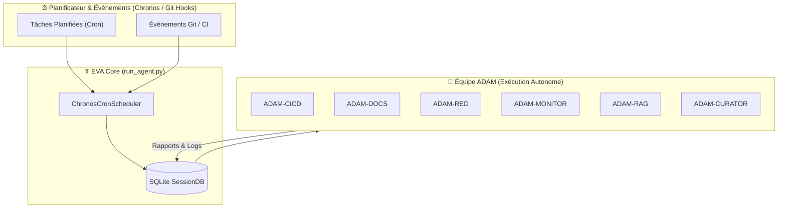

# 🤖 Équipe d'Agents Autonomes ADAM

Dans l'architecture **The Hive** d'EVA, l'agent central orchestre une équipe de **12 agents autonomes spécialisés** nommés les **Agents ADAM**. Chaque agent ADAM possède une mission dédiée, des privilèges adaptés et un ensemble de compétences (*skills*) spécifiques.

---

## 📊 Matrice des 12 Agents ADAM

| Agent ADAM | Domaine & Mission | Compétences Dédiées | Déclenchement Cron / Événement | Statut |
| --- | --- | --- | --- | --- |
| **ADAM-CICD** | Pipeline CI/CD, hooks Git, auto-build, validation de PRs. | `software-development`, `devops` | Validation des commits & PRs | ✅ Actif |
| **ADAM-DOCS** | Génération, audit et mise à jour dynamique de la documentation. | `markdown`, `note-taking` | Post-commit / Journalier (`0 2 * * *`) | ✅ Actif |
| **ADAM-LORA** | Extraction de datasets, fine-tuning QLoRA et publication HuggingFace. | `mlops`, `llm`, `python` | Sur demande / Entraînement planifié | ✅ Actif |
| **ADAM-GIT** | Gestion des branches, synchronisation upstream et résolution de conflits. | `github`, `software-development` | Événements Git / Continu | ✅ Actif |
| **ADAM-BACKUP** | Sauvegarde chiffrée de SQLite (`sessions.db`), `config.yaml` et des skills. | `systems`, `security` | Quotidien (`0 3 * * *`) | ✅ Actif |
| **ADAM-TEST** | Exécution des suites Pytest, tests d'intégration E2E et rapports de couverture. | `python`, `software-development` | Pré-commit & Post-build | ✅ Actif |
| **ADAM-RED** | Pentest, audits de vulnérabilités, tests d'intrusion OT/IT et Red Team. | `cybersecurite`, `advanced-security` | Hebdomadaire (`0 1 * * 0`) | ✅ Actif |
| **ADAM-BLUE** | Hardening des conteneurs, correctifs de sécurité et Blue Team defensive. | `security`, `systems` | En réaction à ADAM-RED | ✅ Actif |
| **ADAM-MONITOR**| Surveillance des ressources hardware (GPU/RAM/CPU), alertes & métriques. | `monitoring`, `devops` | Toutes les 5 min (`*/5 * * * *`) | ✅ Actif |
| **ADAM-RAG** | Indexation vectorielle ChromaDB/HippoRAG des documents et manuels. | `rag`, `rag-stack` | Quotidien (`0 4 * * *`) | ✅ Actif |
| **ADAM-DEPLOY** | Déploiement continu des services Docker, rollback et vérification de santé. | `devops`, `docker` | Événement de Release | ✅ Actif |
| **ADAM-CURATOR**| Organisation de la bibliothèque de compétences, dédoublonnage et nettoyage. | `prompt-engineering`, `curator` | Hebdomadaire (`0 5 * * 0`) | ✅ Actif |

---

## 🏗️ Architecture d'Orchestration ADAM

Les agents ADAM s'exécutent de manière asynchrone sans bloquer l'agent principal. Le schéma ci-dessous illustre l'interaction entre le planificateur **Chronos Cron**, l'agent principal EVA et l'équipe ADAM :



---

## ⚙️ Exemples de Commandes `hermes cron`

Pour configurer et activer la surveillance ou les tâches des agents ADAM via la CLI Hermes :

### 1. Activer la surveillance ADAM-MONITOR (Toutes les 5 minutes)
```bash
hermes cron add "*/5 * * * *" "ADAM-MONITOR — Surveillance système & GPU" \
  --skills "devops" \
  --deliver local
```

### 2. Planifier le nettoyage ADAM-CURATOR (Tous les dimanches à 5h00)
```bash
hermes cron add "0 5 * * 0" "ADAM-CURATOR — Organisation & dédoublonnage des compétences" \
  --skills "prompt-engineering" \
  --deliver local
```

### 3. Lister et gérer les jobs ADAM actifs
```bash
hermes cron list
hermes cron remove <JOB_ID>
```
