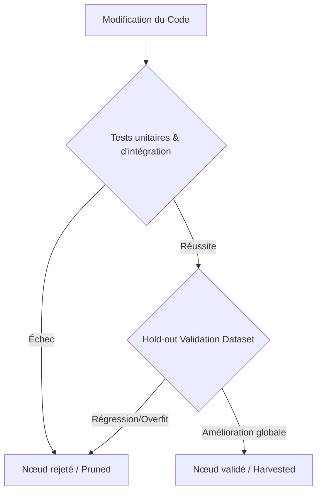

# Optimisation Autonome par Arbre d'Hypothèses (Arbor)

## 1. Vue d'ensemble

Le workflow **Arbor** (Hypothesis-Tree Refinement - HTR) permet de mener à bien des tâches de recherche et d'optimisation complexes à long horizon. Contrairement aux approches linéaires traditionnelles de résolution de problèmes, Arbor traite l'exploration comme un arbre d'hypothèses persistant. Les idées d'optimisation sont explorées de façon non linéaire, validées de manière rigoureuse, puis intégrées ou élaguées selon les résultats obtenus.

Cette compétence structure le processus de décision en deux rôles distincts :
1. **Le Coordinateur Global** (l'agent principal) : Il orchestre l'arbre de recherche, décide des branches d'hypothèses à développer ou à abandonner, et intègre les enseignements (insights).
2. **Les Exécuteurs Éphémères** (via `delegate_task`) : Des sous-agents exécutent les expérimentations de façon isolée (par exemple, dans un git worktree) et mesurent l'impact réel des modifications sur les métriques clés.

---

## 2. Architecture et cycle de vie d'un arbre d'hypothèses

L'état complet de la recherche est consigné dans un fichier structuré `arbor_tree.json` à la racine de l'espace d'exploration.

```json
{
  "objective": "Minimiser la consommation mémoire du parseur JSON sans dégrader le débit.",
  "metrics_definition": {
    "primary": "peak_memory_mb",
    "secondary": "throughput_ops_sec",
    "validation": "test_suite_passed"
  },
  "baseline": {
    "peak_memory_mb": 256.0,
    "throughput_ops_sec": 12000.0,
    "test_suite_passed": true
  },
  "best_candidate": "node_02",
  "nodes": {
    "root": {
      "id": "root",
      "hypothesis": "Implémentation initiale utilisant le parseur standard de la bibliothèque.",
      "parent": null,
      "status": "evaluated",
      "metrics": {
        "peak_memory_mb": 256.0,
        "throughput_ops_sec": 12000.0,
        "test_suite_passed": true
      },
      "code_patch": null,
      "insights": "Le parseur actuel charge l'intégralité du document en mémoire.",
      "children": ["node_01", "node_02"]
    },
    "node_01": {
      "id": "node_01",
      "hypothesis": "Remplacer le chargement complet par un parseur de flux (SAX/streaming).",
      "parent": "root",
      "status": "evaluated",
      "metrics": {
        "peak_memory_mb": 42.0,
        "throughput_ops_sec": 8500.0,
        "test_suite_passed": true
      },
      "code_patch": "patches/node_01.patch",
      "insights": "Réduction drastique de la mémoire, mais baisse de 30% du débit due à l'overhead du streaming.",
      "children": []
    },
    "node_02": {
      "id": "node_02",
      "hypothesis": "Optimiser le parseur initial en utilisant des slots __slots__ et un cache d'objets.",
      "parent": "root",
      "status": "evaluated",
      "metrics": {
        "peak_memory_mb": 110.0,
        "throughput_ops_sec": 13500.0,
        "test_suite_passed": true
      },
      "code_patch": "patches/node_02.patch",
      "insights": "Bon compromis : réduction de 57% de la mémoire et gain de 12% sur le débit.",
      "children": ["node_03"]
    }
  }
}
```

---

## 3. Algorithme systématique de raffinement (HTR)

Le coordinateur doit suivre les étapes suivantes pour exécuter le workflow Arbor :

### Étape 1 : Définir l'objectif et la base de référence (Baseline)
Avant toute modification, l'agent doit exécuter la suite de tests et les benchmarks existants sur l'implémentation actuelle afin de consigner la base de référence dans `arbor_tree.json`.
*Outils requis :* `terminal`, `write_to_file`.

### Étape 2 : Générer des hypothèses d'optimisation
En analysant les nœuds existants (en particulier la branche du meilleur candidat actuel), le coordinateur formule de nouvelles hypothèses. Il existe trois types de générations d'hypothèses :
* **Exploratoire** : Introduire une nouvelle approche ou structure (ex. changer d'algorithme).
* **Corrective** : Résoudre un effet de bord identifié lors d'une évaluation précédente (ex. rétablir le débit perdu dans une branche).
* **Raffinement** : Ajuster des hyperparamètres ou optimiser des détails locaux d'une branche réussie.

### Étape 3 : Sélectionner et instancier un exécuteur isolé
Pour évaluer une hypothèse, le coordinateur doit déléguer le travail à un sous-agent. L'exécuteur doit travailler dans un espace de travail isolé (par exemple, un git worktree) pour éviter tout conflit de fichiers en cas d'échec ou d'exécutions parallèles.

```python
delegate_task(
    goal="Évaluer l'hypothèse node_03 : Ajouter un cache d'objets réutilisables au parseur du node_02.",
    context="""
    OBJECTIF : Réduire encore la mémoire du node_02.
    
    INSTRUCTIONS DE DÉPART :
    1. Appliquer le patch du parent : patches/node_02.patch
    2. Implémenter l'hypothèse : ajouter un pool d'objets réutilisables pour éviter l'allocation fréquente de dictionnaires.
    3. Lancer les tests unitaires pour valider le comportement : pytest tests/test_sort.py
    4. Si les tests passent, lancer le script de benchmark : python benchmark.py
    
    LIVRABLES ATTENDUS :
    - Fichier patch des modifications : patches/node_03.patch
    - Métriques obtenues (mémoire de crête et débit)
    - Enseignements (insights) sur le comportement observé
    """,
    toolsets=["terminal", "file"]
)
```

### Étape 4 : Évaluation et validation par le filtre (Verification Gate)
L'exécuteur renvoie les résultats au coordinateur. Pour être acceptée comme une amélioration, l'implémentation doit passer par deux verrous :
1. **Le verrou de validité (Correction)** : La suite complète de tests unitaires et d'intégration doit réussir à 100%. Aucune régression n'est tolérée.
2. **Le verrou de surapprentissage (Generalization Gate)** : Pour éviter que le code soit sur-optimisé uniquement pour le jeu de benchmark fourni (overfitting), le coordinateur peut demander à l'exécuteur de lancer les tests de performance sur un jeu de données de validation distinct ou "hold-out dataset".

### Étape 5 : Mise à jour de l'arbre et décision de parcours
Le coordinateur met à jour `arbor_tree.json` :
* **Succès** : Si les métriques sont meilleures que le meilleur candidat précédent, le nouveau nœud est enregistré comme `best_candidate`.
* **Échec / Régression** : Si les performances régressent ou si les tests échouent, le nœud est marqué comme `pruned` (élagué). Les insights d'échec (ex. "le cache d'objets génère des collisions de thread" ou "le ramasse-miettes passe trop de temps sur les petits objets") sont remontés au parent.

---

## 4. Algorithmes avancés d'Arbor (Détails du Papier de Recherche)

Pour égaler la rigueur du framework Arbor original, plusieurs mécanismes avancés doivent être implémentés au niveau du coordinateur.

### A. Sélection des candidats par politique UCT (Upper Confidence Bound for Trees)
Plutôt que de choisir systématiquement le meilleur nœud de validation, le coordinateur utilise une formule de compromis exploration/exploitation pour sélectionner le nœud parent à étendre.

La priorité d'extension d'un nœud $i$ est calculée par :
$$Score(i) = Performance(i) + C \times \sqrt{\frac{\ln(N_{total})}{N_i + 1}} - \beta \times Depth(i)$$

*   $Performance(i)$ : Score normalisé de l'amélioration (ex. gain de temps en %).
*   $N_i$ : Nombre de fois que le nœud $i$ a été choisi comme parent d'une hypothèse.
*   $N_{total}$ : Nombre total d'hypothèses évaluées dans l'arbre.
*   $C$ : Constante d'exploration (par défaut `0.5`).
*   $Depth(i)$ : Profondeur du nœud dans l'arbre. Le terme de pénalité de profondeur ($\beta \times Depth(i)$) décourage l'agent de s'enfoncer trop profondément dans des micro-optimisations locales inutiles au détriment d'idées globales plus larges.

### B. Génération d'hypothèses guidée par le contexte d'échec (Anti-Correction)
Lors de l'utilisation du LLM pour formuler de nouvelles hypothèses, le coordinateur injecte systématiquement les **insights d'échecs de la fratrie** (les nœuds ayant le même parent et ayant échoué).

**Exemple de modèle de prompt de mutation (Coordinateur) :**
```text
Vous devez générer la prochaine hypothèse d'optimisation pour le nœud [node_02].
Code actuel du nœud parent : [voir patches/node_02.patch]
Métrique du nœud parent : 110.0 MB.

Hypothèses déjà explorées à partir de ce parent et ayant échoué (Ne les répétez pas et évitez les techniques similaires) :
- Nœud [node_03] (Échec) : Ajout d'un pool d'objets. Insight d'échec : WinError 32 / PermissionError sur le cache d'accès concurrent.
- Nœud [node_04] (Échec) : Réduction de la taille des chunks à 4KB. Insight d'échec : Augmentation de 40% des requêtes système I/O, temps dégradé à 1.9s.

Proposez une nouvelle hypothèse qui contourne ces limitations logiques.
```

### C. Règles heuristiques d'élagage automatique (Pruning Rules)
Pour économiser le budget de jetons d'API et le temps de calcul, appliquez les heuristiques d'élagage suivantes sur l'arbre de recherche :
1. **Élagage de sous-arbre stérile** : Si un nœud parent a donné naissance à 3 hypothèses enfants successives qui ont toutes échoué ou régressé, le nœud parent lui-même est marqué `stale` (périmé) et retiré de la file d'attente de sélection.
2. **Seuil de tolérance de régression** : Si une hypothèse dégrade la métrique primaire de plus de 50% ou échoue à compiler, elle est élaguée immédiatement sans faire l'objet de tentatives de correction secondaires.
3. **Plafond d'amélioration asymptotique** : Si la différence de performance entre le meilleur candidat actuel et sa branche parente est inférieure à 1% sur 2 générations consécutives, l'exploration sur ce sous-arbre est coupée car les gains de performance atteignent un plateau.

---

## 5. Gestion des verrous de validation (Verification Gates)

Pour garantir la robustesse des optimisations, appliquez des règles strictes lors de la validation des nœuds :



### hold-out Dataset (Jeu de données de validation indépendant)
* **Pourquoi ?** Un sous-agent peut facilement réécrire une fonction pour qu'elle réponde très rapidement à un scénario précis du benchmark principal, mais cela peut casser le comportement général ou ralentir d'autres scénarios.
* **Mise en œuvre :** Conservez une partie des scénarios de test dans un répertoire distinct (par exemple `tests/validation_harness/`) qui n'est exécuté que lors de l'étape finale d'évaluation du nœud.

---

## 6. Exemple concret : Optimisation de requêtes de base de données

### Étape 1 : Le coordinateur crée l'arbre initial
L'objectif est d'optimiser le temps de réponse d'un service d'API qui effectue des jointures SQL complexes. Le temps initial de l'API est de 850ms.

### Étape 2 : Exploration de la branche 1 (Indexation)
* **Hypothèse node_01** : Ajouter un index composite sur `(user_id, status)` dans la table SQL.
* **Exécution** : Le sous-agent applique l'index. Les tests passent. Le benchmark montre un temps de 320ms.
* **Mise à jour** : Le nœud est validé. `best_candidate` devient `node_01`.

### Étape 3 : Exploration de la branche 2 (Mise en cache)
* **Hypothèse node_02** : Mettre en cache les résultats bruts dans Redis pendant 60 secondes.
* **Exécution** : Le sous-agent configure Redis. Les tests de validation du hold-out échouent car la cohérence des données est rompue (les mises à jour de profils ne sont pas visibles immédiatement).
* **Mise à jour** : Le nœud est marqué `pruned` avec l'insight : *"La mise en cache brute casse l'exigence de cohérence immédiate des données utilisateur."*

### Étape 4 : Correction et raffinement de la branche 1
* **Hypothèse node_03 (Enfant du node_01)** : Partant de `node_01` (avec l'index SQL), ajouter une réécriture de requête (Query Rewrite) pour remplacer une sous-requête corrélée par un `JOIN`.
* **Exécution** : L'exécuteur applique la réécriture sur la base de code du `node_01`. Le benchmark donne 95ms. Tous les tests passent.
* **Mise à jour** : `best_candidate` devient `node_03`.

### Étape 5 : Récolte finale (Harvesting)
L'exploration s'arrête. Le coordinateur applique définitivement le patch `patches/node_03.patch` sur la branche principale du dépôt.

---

## 7. Règles de développement d'une branche (Git Worktrees)

Lorsqu'un sous-agent travaille sur une hypothèse, il doit :
1. Créer un espace de travail propre pour la tâche :
   ```bash
   git worktree add -b arbor-node-03 .worktrees/node_03 origin/main
   ```
2. Appliquer les correctifs requis, lancer ses évaluations, puis générer le fichier de patch final :
   ```bash
   git diff origin/main > ../../patches/node_03.patch
   ```
3. Nettoyer l'espace de travail pour libérer les ressources :
   ```bash
   git worktree remove .worktrees/node_03
   ```
   *Note :* En cas d'erreur de privilèges système sur Windows pour la création de liens ou de dossiers de travail, l'exécuteur peut basculer sur une copie de répertoire temporaire standard isolée.

---

## 8. Résumé des invariants de performance

* **Ne jamais optimiser sans mesurer** : Chaque amélioration proposée doit être étayée par des mesures chiffrées de mémoire de crête, de temps CPU ou de latence réseau.
* **Consigner les échecs** : Les raisons pour lesquelles une idée a échoué sont aussi importantes que celles qui ont fonctionné ; elles empêchent l'agent d'explorer des branches similaires à l'avenir.
* **Vérification croisée obligatoire** : Un gain de performance au détriment de la validité fonctionnelle (tests cassés) entraîne le rejet immédiat du nœud.
