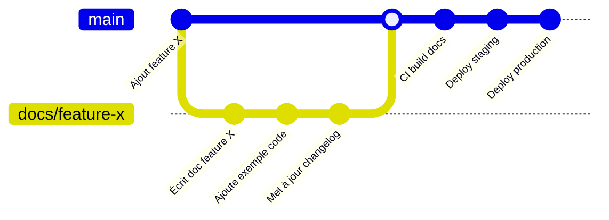

# Documentation Systems

## Overview

Un système de documentation est l'infrastructure qui transforme des fichiers Markdown en site web navigable, versionné, recherchable et déployé. Ce skill couvre la sélection de plateforme, l'architecture docs-as-code, la gestion des versions, le search, la i18n, la rétrocompatibilité et le déploiement continu.

## When to Use

- L'utilisateur demande de choisir ou configurer un générateur de documentation
- Vous devez mettre en place un workflow docs-as-code (Git → Build → Deploy)
- Gestion de versions multiples de documentation (v1.x, v2.x, latest)
- Configuration de la recherche, de la i18n ou des redirections
- Audit d'une infrastructure documentation existante

## Docs-as-Code : Les Piliers

### Principe
La documentation suit le même cycle de vie que le code source : elle vit dans le même dépôt, passe en revue par PR, est testée en CI, déployée automatiquement.

### Workflow Standard



### CI Pipeline Minimal

```yaml
name: Docs CI/CD
on:
  push:
    branches: [main]
    paths: ["docs/**", "mkdocs.yml"]
  pull_request:
    paths: ["docs/**"]
jobs:
  validate:
    runs-on: ubuntu-latest
    steps:
      - uses: actions/checkout@v4
      - uses: actions/setup-python@v5
      - run: pip install mkdocs mkdocs-material
      - run: mkdocs build --strict
      - run: pip install linkchecker
      - run: linkchecker site/ --check-extern
      - if: github.ref == 'refs/heads/main'
        run: mkdocs gh-deploy --force
```

## Comparaison des Plateformes

| Critère | MkDocs Material | Docusaurus | Sphinx | mdBook |
|---------|----------------|------------|--------|--------|
| **Langue** | Python | JS/React | Python | Rust |
| **Facilité** | Très simple | Modéré | Complexe | Simple |
| **Thèmes** | Material Design | Custom React | Plusieurs | Built-in |
| **Search** | Intégré (lunr) | Algolia/DocSearch | Intégré | Intégré |
| **i18n** | Plugin | Natif | Plugin | Non |
| **Versions** | Plugin mike | Natif | Plugin | Non |
| **Blog** | Plugin blog | Natif | Plugin | Non |
| **API Docs** | Plugin | Plugin (OpenAPI) | autodoc | Non |
| **Idéal pour** | Docs techniques | Docs produit + blog | Docs Python/lib | Docs CLI |

## Gestion des Versions

### Stratégie de Branches pour Documentation

```
main ─── latest (version en cours)
  ├── v1.x ─── frozen (plus qu corrections sécurité)
  └── v2.x ─── active (nouvelles fonctionnalités)
```

### Workflow avec mike (MkDocs)

```bash
# Publier une version
mike deploy --push --update-aliases 2.0.0 latest
mike set-default --push latest

# Publier une version de maintenance
mike deploy --push 1.5.2

# Liste des versions déployées
mike list
```

### Badge de Version

```markdown


```

## Fonctionnalités Avancées

### Recherche

- **DocSearch (Algolia)** — Crawler gratuit pour open-source, configuration via `config.json`
- **Pagefind** — Recherche côté client sans serveur, compatible tout SSG
- **Lunr.js** — Intégré MkDocs, index côté client, pas de dépendance externe

### Internationalisation (i18n)

Arborescence recommandée :
```
docs/
├── en/
│   ├── getting-started.md
│   └── configuration.md
├── fr/
│   ├── getting-started.md
│   └── configuration.md
└── de/
    ├── getting-started.md
    └── configuration.md
```

### Redirections et URLs Permanentes

```yaml
# mkdocs.yml
plugins:
  - redirects:
      redirect_maps:
        'ancienne-page.md': 'nouvelle-page.md'
        'api/v1/': '../v2/'
```

## Rétrocompatibilité des URLs

Règle d'or : **Une URL de documentation est éternelle.**

- Ne jamais supprimer une page existante sans redirection 301
- Utiliser des slugs versionnés : `/v1/configuration/` → `/v2/configuration/`
- Les assets (images, fichiers) ont des chemins versionnés aussi

## SEO pour Documentation

1. Frontmatter avec `title`, `description`, `og:image` pour chaque page
2. `sitemap.xml` automatisé (plugins MkDocs/Sphinx le génèrent)
3. URLs canoniques : configurer `site_url` dans la config du SSG
4. `robots.txt` : autoriser les crawlers, bloquer `/v1/` si dépréciée
5. Breadcrumbs : amélioration du parcours de navigation

## Métriques de Documentation

| Métrique | Ce qu'elle mesure | Seuil d'alerte |
|----------|-------------------|----------------|
| Pages orphelines | Pages sans lien entrant | > 5% du total |
| Pages sans date | Âge du contenu | > 30% sans date |
| Pages sans tags | Découvrabilité | > 20% non taggées |
| Liens brisés | Santé du site | Un seul lien brisé |
| Temps de build | Performance CI | > 5 minutes |
| Pages 404 (semaine) | URLs cassées | > 10 |

## Common Pitfalls

1. **Pas de versioning.** Publier par-dessus la documentation existante sans garder les anciennes versions = casser les liens des utilisateurs.
2. **Recherche non configurée.** Une doc sans moteur de recherche est inutilisable au-delà de 20 pages.
3. **Build qui échoue silencieusement.** Mode `--strict` obligatoire en CI. Une page avec frontmatter cassé ne doit pas être déployée.
4. **Déploiement manuel.** Sans CI/CD, la documentation devient vite obsolète car personne ne pense à rebuild.
5. **Absence de redirections.** Renommer une page sans redirection = 404 pour tous les utilisateurs qui avaient bookmarké.

## Verification Checklist

- [ ] Générateur SSG configuré avec thème, search et plugins
- [ ] Pipeline CI/CD en place (build --strict + déploiement auto)
- [ ] URLs stables (redirections pour les pages renommées)
- [ ] Versions multiples configurées si le projet a > 1 version active
- [ ] Recherche fonctionnelle sur le site déployé
- [ ] Sitemap.xml et robots.txt présents
- [ ] Aucun lien brisé (vérifié en CI)
- [ ] Frontmatter présent sur chaque page (title, description, date)
- [ ] Métriques de documentation suivies (au moins les pages orphelines et les liens brisés)