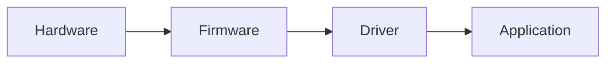

# Markdown Systems

## Overview

Markdown est le langage universel de la documentation technique. Mais le Markdown brut ne suffit pas pour une documentation professionnelle. Ce skill couvre l'écosystème complet : syntaxe étendue (MDX, admonitions, diagrammes), générateurs de sites statiques, linting, templates et pipelines d'intégration continue (docs-as-code).

## When to Use

- L'utilisateur demande de configurer un générateur de documentation (MkDocs, Docusaurus, etc.)
- Vous devez lint, valider ou normaliser un ensemble de fichiers Markdown
- Création de templates, snippets ou conventions pour un projet de documentation Markdown
- Documentation avec diagrammes (Mermaid), formules mathématiques (LaTeX), ou composants interactifs (MDX)
- Automatisation de la génération et du déploiement de documentation

## Syntaxe Étendue (CommonMark + Extensions)

### Admonitions / Callouts

```
> **Note :** Conseil ou information contextuelle.
> **Warning :** Attention, conséquence négative possible.
> **Danger :** Risque critique (perte de données, sécurité).
> **Tip :** Alternative ou astuce.
```

### Diagrammes Mermaid



Diagrammes supportés : `graph` (flowchart), `sequenceDiagram`, `classDiagram`, `stateDiagram`,
`pie`, `gantt`, `gitGraph`, `erDiagram`, `journey`

### Tables Avancées

```markdown
| Feature | CLI | API | SDK |
|:--------|:---:|:---:|:---:|
| Création | ✅ | ✅ | ✅ |
| Suppression | ✅ | ✅ | ❌ |
| Mise à jour batch | ❌ | ✅ | ❌ |
```

### Frontmatter YAML

```yaml
---
title: "Mon Article"
description: "Résumé pour les moteurs de recherche"
authors: [EVA]
date: 2026-07-22
draft: false
tags: [markdown, documentation]
---
```

### MDX (JSX dans Markdown)

Permet d'intégrer des composants React dans la documentation :
```mdx
import { Chart } from '../components/Chart'

# Analyse des Performances

Retourne les métriques en temps réel.

<Chart data={props.metrics} />

> **Note :** Les données sont mises à jour toutes les 5 minutes.
```

## Générateurs de Sites Statiques (SSG)

| SSG | Langue | Idéal pour | Points forts |
|-----|--------|------------|--------------|
| **MkDocs** | Python | Docs techniques, API | Simple, Material theme, plugins |
| **Docusaurus** | React/JS | Docs produit, blogs | MDX, versions, i18n, search |
| **VitePress** | Vue/JS | Docs projets Vue | Rapide, natif ESM |
| **mdBook** | Rust | Docs CLI/API | Minimal, search intégré |

### Workflow MkDocs (recommandé pour docs techniques)

```yaml
# mkdocs.yml
site_name: Projet Documentation
site_url: https://docs.example.com
theme:
  name: material
  features:
    - content.tabs.link
    - navigation.tabs
    - navigation.expand
    - search.suggest
plugins:
  - search
  - minify:
      minify_html: true
markdown_extensions:
  - admonition
  - pymdownx.details
  - pymdownx.superfences:
      custom_fences:
        - name: mermaid
          class: mermaid
  - pymdownx.tabbed
  - tables
```

## Linting et Validation

### markdownlint (Règles Essentielles)

```bash
# Règles critiques (erreur si violées)
MD001 - Heading levels should only increment by one
MD009 - Trailing spaces
MD012 - Multiple consecutive blank lines
MD022 - Headings should be surrounded by blank lines
# Règles de style (avertissement)
MD013 - Line length (80-120 chars recommandé)
MD024 - Multiple headings with same content
MD032 - Lists should be surrounded by blank lines
MD046 - Code block style (consistent)
```

### .markdownlint.yaml Recommandé

```yaml
MD013:
  line_length: 120
  code_blocks: false
MD033: false  # Autoriser HTML inline (nécessaire pour MDX)
MD046: "fenced" # Forcer les blocs de code avec ```
```

## Pipeline CI (docs-as-code)

```yaml
# .github/workflows/docs.yml
name: Documentation CI
on:
  push:
    branches: [main]
    paths: ["docs/**", "mkdocs.yml"]

jobs:
  build:
    runs-on: ubuntu-latest
    steps:
      - uses: actions/checkout@v4
      - uses: actions/setup-python@v5
      - run: pip install mkdocs mkdocs-material
      - run: mkdocs build --strict  # Échoue sur warning
      - run: npm install -g markdownlint-cli
      - run: markdownlint docs/
      - uses: peaceiris/actions-gh-pages@v3
        with:
          publish_dir: ./site
```

## Templates et Snippets

### Template de Page MkDocs

```markdown
# {{ title }}

## Contexte

{{ one-paragraph context }}

## {{ section }}

{{ content }}
```

### Bloc de Code avec Langue et Titre

```markdown
```python title="src/main.py" linenums="1" hl_lines="3-5"
def hello():
    # Cette ligne n'est pas surlignée
    print("Hello, world!")  # Surlignée
    return True  # Surlignée
```
```

## Common Pitfalls

1. **Frontmatter invalide.** Un YAML mal formé casse tout le générateur. Valider avec `yaml.validate()`.
2. **Images en lien relatif non testé.** Les images fonctionnent en local mais cassent en build. Toujours vérifier le chemin dans le site généré.
3. **Extensions incompatibles.** Toutes les extensions ne fonctionnent pas avec tous les SSG. Vérifier la compatibilité avant d'écrire (ex: Mermaid avec MkDocs nécessite un plugin).
4. **Liens brisés invisibles.** Un lien brisé en Markdown brut ne fait pas d'erreur. Utiliser `mkdocs build --strict` ou un vérificateur de liens.
5. **Documentation à côté du code.** Si la doc vit dans un dépôt séparé du code, elle devient obsolète. Préférer monorepo ou docs dans le même dépôt.

## Verification Checklist

- [ ] Frontmatter YAML valide pour tous les fichiers
- [ ] Aucune erreur markdownlint (niveau error)
- [ ] Liens internes valides après build
- [ ] Images et assets accessibles dans le site généré
- [ ] Extensions déclarées dans la config du SSG
- [ ] Build en mode `--strict` passe
- [ ] Pipeline CI configuré pour rebuild automatique